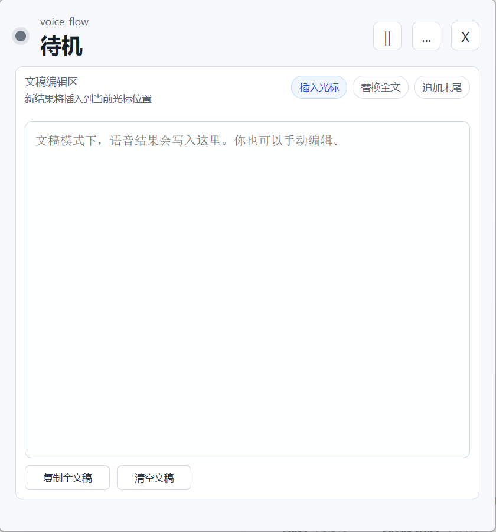

# voice-flow · 语音输入法

按住快捷键说话，松开自动粘贴文本到光标位置。**端侧 ASR 默认开启**，离线可用、隐私不离开设备；DeepSeek API key 可选用于 AI 改写。

---

## 一、产品介绍

voice-flow 是一款 Windows 优先的桌面语音输入法：

- **端侧默认**：内置 sherpa-onnx Streaming Zipformer (zh-en bilingual) 模型，安装即用、无需联网
- **🎯 用嘴指挥 AI 改写**：不用点任何菜单，说话时夹一句 "写成邮件"、"改正式一点"、"列点"、"写成 commit"，voice-flow 会自动识别指令、切换改写风格，输出加工后的成品文本
- **两种交互形态**：常驻悬浮窗（按住说话松开自动粘贴到外部应用） + 文稿编辑模式（语音 + 手动混编）
- **零干扰**：托盘常驻、关闭隐藏、随时暂停监听

### 三个界面

#### 1. 悬浮窗模式（默认）

110×110 小窗常驻桌面，不抢焦点。按住 `Alt+Space` 说话，松开自动转写并粘贴到当前光标所在的任意应用（聊天框、浏览器、IDE 等等）。


#### 2. 文稿模式

长文档场景。语音结果按"插入光标 / 替换全文 / 追加末尾"三种模式写入内置文稿编辑器，可与键盘手动编辑混用。



#### 3. 设置

只有两页 tab：

- **输入**：ASR 引擎（Local / Cloud）切换、Cloud key 管理、自定义全局快捷键
- **改写**：AI 改写开关、改写风格选择


### AI 改写（核心差异化功能）

普通语音输入只解决"语音 → 字"。voice-flow 多了一层——**你可以直接用嘴告诉它怎么改**，不用先点设置选什么模式。

**链路**：

```
按住说话 → ASR (sherpa-onnx) → 识别口头指令 + LLM 改写 → 自动粘贴
```

#### 用嘴指挥，零 UI 操作

直接在你要表达的内容里**夹一句指令**，voice-flow 会自动识别、切换改写风格、把指令本身从文本里剥掉。例子：

```
你说：  "写成邮件，下午开会推迟到三点，麻烦各位调整一下日程"
粘贴：  尊敬的各位同事：
        因故下午会议推迟至三点举行，烦请各位调整日程安排，谢谢配合。
        此致
        敬礼

你说：  "刚跟客户对了下，他们倾向方案 B，技术上没问题，改正式一点"
粘贴：  经与客户沟通确认，客户倾向选择方案 B；技术层面无障碍。

你说：  "列下今晚要做的事，写代码、写文档、给老板发周报、跑测试"
粘贴：  - 写代码
        - 写文档
        - 给老板发周报
        - 跑测试

你说：  "修复录音爆音问题，写成 commit"
粘贴：  fix(audio): resolve recording clipping issue
```

支持的口头指令短语：

| 你说什么                                  | voice-flow 会怎么改                  |
| ----------------------------------------- | ------------------------------------- |
| "改正式一点" / "正式一点" / "语气正式一点" | 润色为正式书面语，保留你的语气         |
| "写成邮件" / "改成邮件" / "写个邮件"       | 整理成中文邮件正文，加称呼/正文/结束语 |
| "写成微信" / "聊天语气"                    | 微信口吻，自然但去掉口头禅             |
| "改成要点" / "列点" / "写成要点"           | 转成 markdown 项目列表                 |
| "写成 commit" / "提交信息"                 | 转成 Conventional Commit 格式           |
| "写成 prompt" / "提示词"                   | 优化为给 LLM 用的清晰 prompt            |
| "多版本" / "给我几个版本"                  | 同时输出多个改写候选                   |
| "改短一点" / "压缩一下" / "改成英文"        | 简化/翻译                              |

> 如果你没说指令，voice-flow 会按设置页里选的默认风格改写（默认 Clean = 去口头禅、补标点）。

#### 设计上的考虑

- **Fallback**：LLM 调用失败 / 超时 / key 缺失 时自动回退到原始 ASR 文本，不阻塞输入流——AI 出问题不会让你白说一段话
- **Provider 支持**：DeepSeek（默认，便宜 + 中文好）、阿里 DashScope qwen、OpenAI
- **Key 安全**：API key 保存在 Windows Credential Manager，不写入 app.toml、不入 git

> **AI 改写需要 DeepSeek API key**。安装后首次启动会弹出原生输入框让你粘贴；留空跳过则只用本地 ASR（不联网）。
> **评委体验**：请联系作者获取测试用的 DeepSeek key。

---

## 二、构建与运行

### 方式 A：下载 Windows 安装包（推荐评委 / 体验用户）

1. 从 [Gitee Releases](https://gitee.com/MuMuNan/voice-flow/releases) 下载最新的 `voice-flow_x.y.z_x64-setup.exe`（约 200 MB，含端侧 ASR 模型）
2. 双击安装，启动应用
3. 首次启动会弹窗询问 DeepSeek API key：
   - 想用 AI 改写：粘贴 key → 确定
   - 暂不用：留空 → 确定（应用仍可使用，只是 AI 改写默认关闭）
4. 默认快捷键 `Alt+Space`，按住说话松开自动粘贴

### 方式 B：从源码编译

适合开发者本地调试。

```bash
# 1. 准备 sherpa-onnx 静态库 + ASR 模型权重
bash scripts/download-models.sh
export SHERPA_ONNX_ARCHIVE_DIR=$HOME/.cache/voice-flow/sherpa-onnx

# 2. CLI 验证（可选）
cargo build
cargo run -p voice-cli -- record out.wav --duration 5s
export VOICE_FLOW_SHERPA_ZIPFORMER_MODEL_DIR=models/sherpa-onnx-streaming-zipformer-bilingual-zh-en-2023-02-20
cargo run -p voice-cli -- transcribe out.wav

# 3. 桌面开发模式
cargo tauri dev --manifest-path apps/desktop/src-tauri/Cargo.toml

# 4. 打包 Windows installer（产出 MSI + NSIS setup.exe，包含模型）
cargo tauri build --manifest-path apps/desktop/src-tauri/Cargo.toml
# 产物位置：apps/desktop/src-tauri/target/release/bundle/{msi,nsis}/
```

AI 改写在 CLI 也可调用：

```bash
export DEEPSEEK_API_KEY=...
echo "嗯，跟老师说一下，今天下午可能因为地铁晚点要晚到十分钟左右。" \
  | cargo run -p voice-cli -- rewrite --profile clean --provider deepseek
```

可用 profile：`off`、`clean`、`polish`、`email`、`wechat`、`bullets`、`commit`、`prompt`、`multi`。可用 provider：`deepseek`、`dashscope`、`openai`；对应环境变量为 `DEEPSEEK_API_KEY`、`DASHSCOPE_API_KEY`、`OPENAI_API_KEY`。

### 测试

```bash
# 不需要 LLM key
cargo test -p voice-rewrite
cargo test -p voice-core

# 真实 DeepSeek smoke 测试（默认 ignored）
cargo test -p voice-rewrite --test live_deepseek_examples -- --ignored --nocapture --test-threads=1
```

---

## 三、项目结构

```
voice-flow/
├── Cargo.toml              # workspace
├── crates/
│   ├── voice-core/         # 录音 + 引擎路由 + 模式系统
│   ├── voice-asr-local/    # 端侧 ASR（sherpa-onnx）
│   ├── voice-asr-cloud/    # 云端 ASR（DashScope Paraformer）
│   ├── voice-rewrite/      # AI 改写管道（profile / provider / fallback）
│   └── voice-cli/          # CLI 验证工具
├── apps/desktop/           # Tauri 应用（Windows-first）
├── models/                 # ASR 模型权重（gitignore，由 scripts/download-models.sh 下载）
├── figures/                # README 截图
└── docs/                   # ai-coding 执行计划、调试笔记、demo 脚本、fixtures
```

## 四、技术栈

| 层 | 选型 | License |
|---|---|---|
| 核心引擎 | Rust | - |
| 音频采集 | [`cpal`](https://crates.io/crates/cpal) | Apache-2.0 / MIT |
| 端侧 ASR（默认） | [sherpa-onnx](https://github.com/k2-fsa/sherpa-onnx) + Streaming Zipformer-bilingual zh-en | Apache-2.0 |
| ASR 绑定 | 官方 [`sherpa-onnx`](https://crates.io/crates/sherpa-onnx) Rust binding | Apache-2.0 |
| 云端 ASR（可选） | 阿里云 DashScope Paraformer-realtime-v2 | - |
| LLM 改写 | DeepSeek / DashScope (qwen) / OpenAI | - |
| 全局快捷键 | [`global-hotkey`](https://crates.io/crates/global-hotkey) (CLI) + Tauri global-shortcut plugin (desktop) | - |
| 剪贴板 / 模拟粘贴 | [`arboard`](https://crates.io/crates/arboard) + [`enigo`](https://crates.io/crates/enigo) | MIT |
| 桌面外壳 | [Tauri v2](https://tauri.app/) | Apache-2.0 / MIT |
| Key 存储 | [`keyring`](https://crates.io/crates/keyring) → Windows Credential Manager | - |

## 五、文档

- 主路线：[`docs/plan.md`](./docs/plan.md)
- AI 改写设计：[`docs/ai_rewrite_plan.md`](./docs/ai_rewrite_plan.md)
- Windows 桌面 GUI 路线：[`docs/desktop_gui_plan.md`](./docs/desktop_gui_plan.md)
- 桌面打包：[`docs/desktop-packaging.md`](./docs/desktop-packaging.md)
- Windows 手测：[`docs/windows_testing.md`](./docs/windows_testing.md)
- Demo 脚本：[`docs/demo-script.md`](./docs/demo-script.md)
- 已知未解问题：[`docs/known-issues.md`](./docs/known-issues.md)

完整 ai-coding 执行计划、调试笔记、fixtures 均在 [`docs/`](./docs) 目录下。

## 六、许可证

[Apache License 2.0](./LICENSE)
